# Dialogue and Chapter Text

All dialogue and chapter text is stored in .txt files formatted as JSON files. JSON is a pretty standard and readable format to begin with, and we have been able to develop tools to be able to modify comfortably the text, overwrite the file and reimport it into the game. If you have a web developer among your team, most likely they will be able to do something meaningful with this JSON on a technical level.

## Chapter Files and Asset IDs

In the Steam version for The Silver Case, the Asset IDs for the chapter files are as follow:

| Chapter | File Name | Asset Id / Path Id |
| :---- | :---- | :---- |
| lunatics | LunMessage.txt | 1258 |
| decoyman | DecMessage.txt | 1142 |
| spectrum | SpeMessage.txt | 1080 |
| parade | ParMessage.txt | 1014 |
| kamuidrome | KamMessage.txt | 1156 |
| lifecut | LifMessage.txt | 1318 |
| danwa | NIWMessage.txt | 1114 |
| whiteout | WhiMessage.txt | 1129 |
| YUME | RDEMessage.txt | 1349 |
| HANA | RSPMessage.txt | 1098 |
| TSUKI | RPAMessage.txt | 1086 |
| AI | RKAMessage.txt | 1124 |
| HIKARI | RLIMessage.txt | 1100 |
| YAMI | YAMIMessage.txt | 1331 |

## Exporting with UABEA

1. Open UABEA

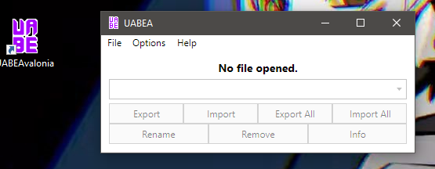

2. Load "resources.assets"

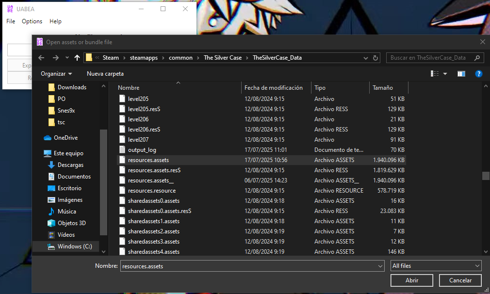

3. Click on the container table head to order files by container (this groups all scripts together)

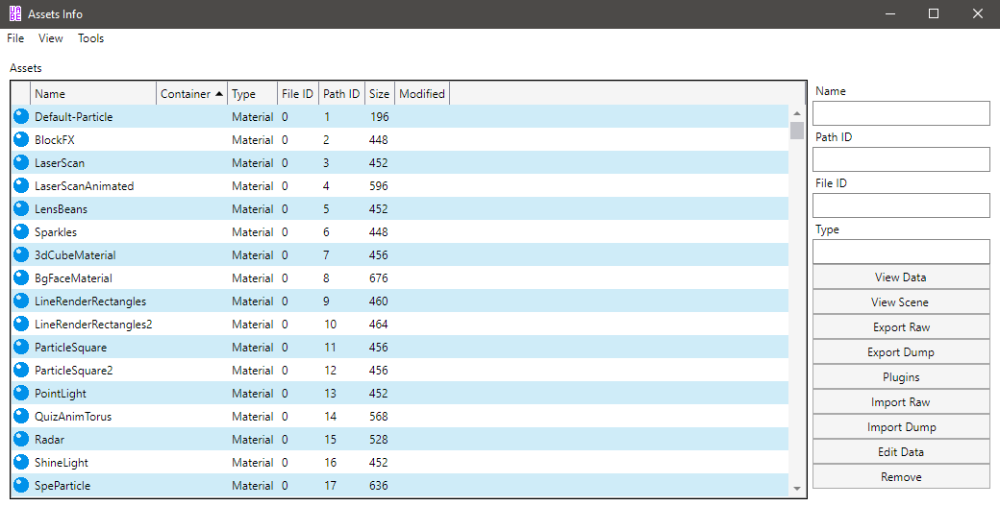

4. Click on View > Go to Asset

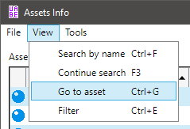

5. Input the asset id for a specific asset (e.g., 1100 for HIKARI script)

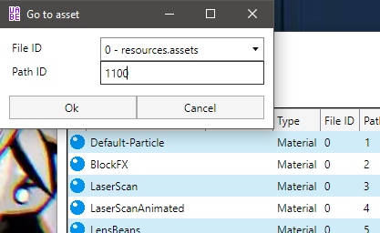

6. You'll see them all grouped up here as type: textAsset

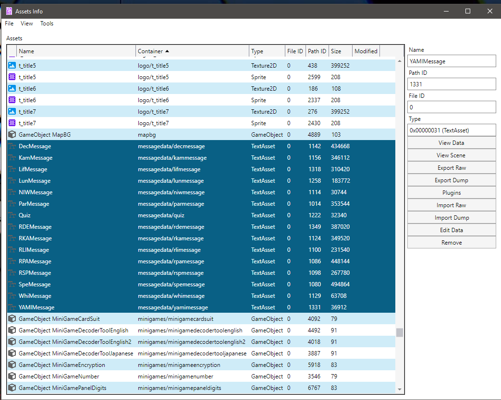

7. Highlight all of them or select the specific script you want to export
8. Click on "Plugins" button on the right side
9. Select "export .txt" and click Ok

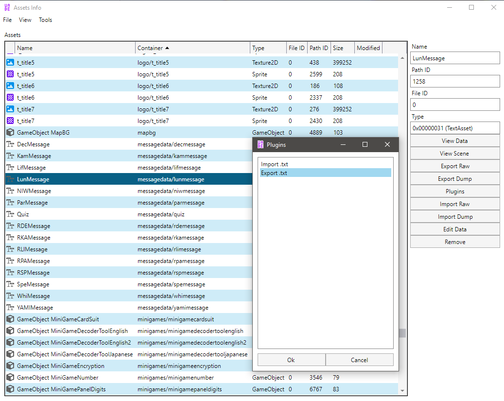

10. It will prompt you to save the file somewhere in your PC

## Importing with UABEA

1. Follow the same steps as exporting
2. Select the "import .txt" option
3. It will prompt you to select a file to import
4. Go to File > Save and wait for it to save

5. You can then check the changes

## Exporting/Importing with UnityEX

Once you know the Asset Ids:

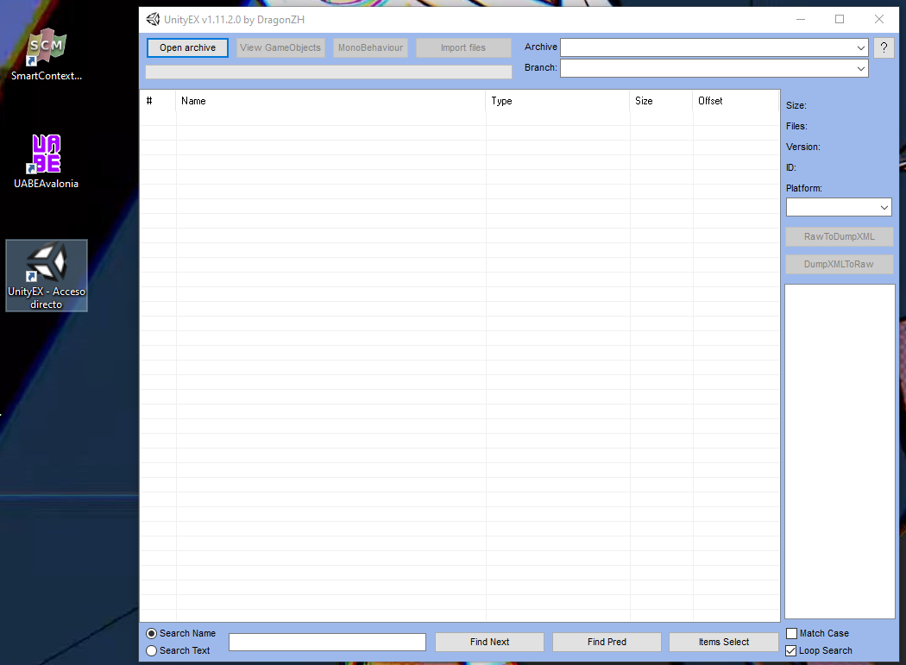

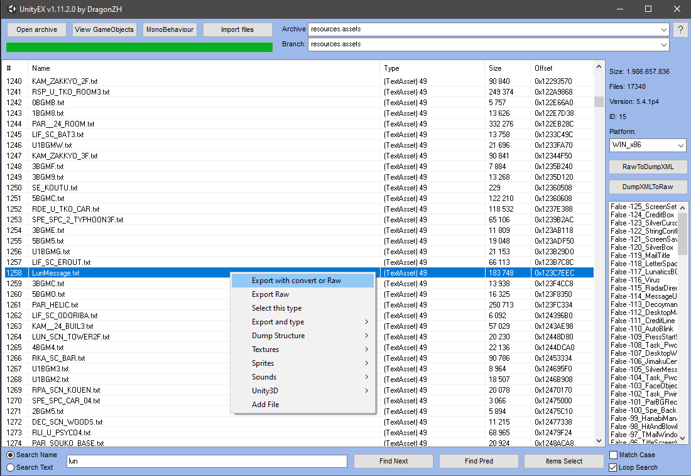

1. Export the file you want
2. UnityEX will export files inside the TheSilverCase_Data/Unity_Asset_Files folder

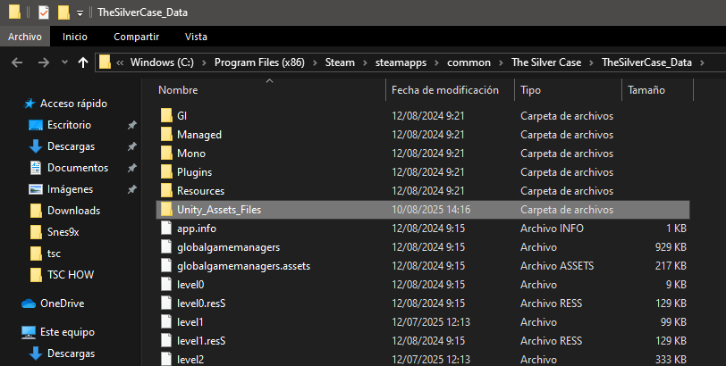

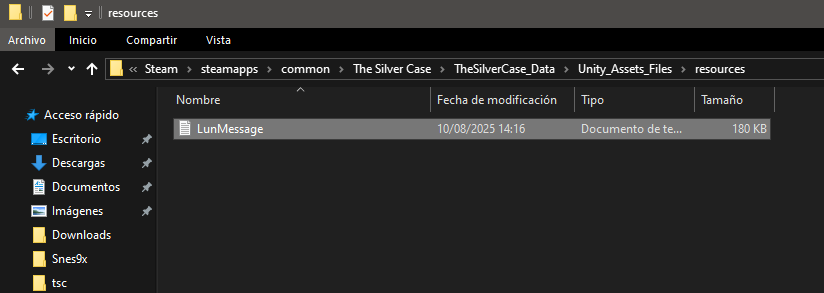

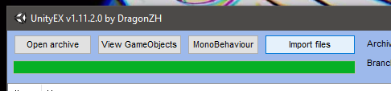

3. UnityEX creates a folder structure that corresponds with the internal folder structure of the game
4. **IMPORTANT**: Do NOT change the files locations, because UnityEX uses the same system for importing files
5. UnityEX reads the files within this file structure and replaces the game files appropriately
6. For importing, follow the reverse process using the same folder structure

## Editing with TSC Editor

Once you have the chapter text downloaded, you can edit it in a number of ways. The most raw approach is to open it in some JSON formatter and edit it right there. However, there's a specialized tool:

[TSC Editor](https://github.com/guipradi5/tsc-editor/)

This is a NodeJS web application that can be run locally. Instructions are in the repository.

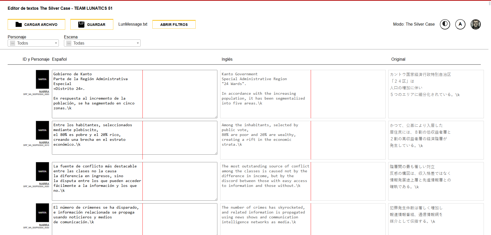

You have the character that says the line, the dialogue ID, the text to edit, the text in english and the text in japanese.

At the end, normally, you can find the texts used for the scene introductions like the hours at which events occur, locations and contexts:

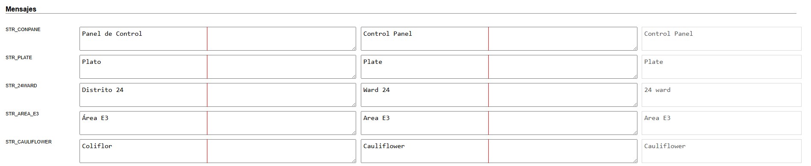

Features:

- View the character that says the line
- See the dialogue ID
- Edit the text
- Compare text in English and Japanese
- Filter by character and scenes
- View scene introductions (hours, locations, contexts)

## Important Considerations

- You can only save by pressing the "Guardar" button (English support will come later)
- The application doesn't save your changes automatically - you must do so manually
- Once you save, the application will prompt you to save the new file
- This file can be imported once more into the game
- **Technical detail**: Files must operate under 1 scape (\n) if using more than 1 scape (\\n) it won't work

## Reimporting and Testing

Once you save the file, reimport it into the game and test it.
