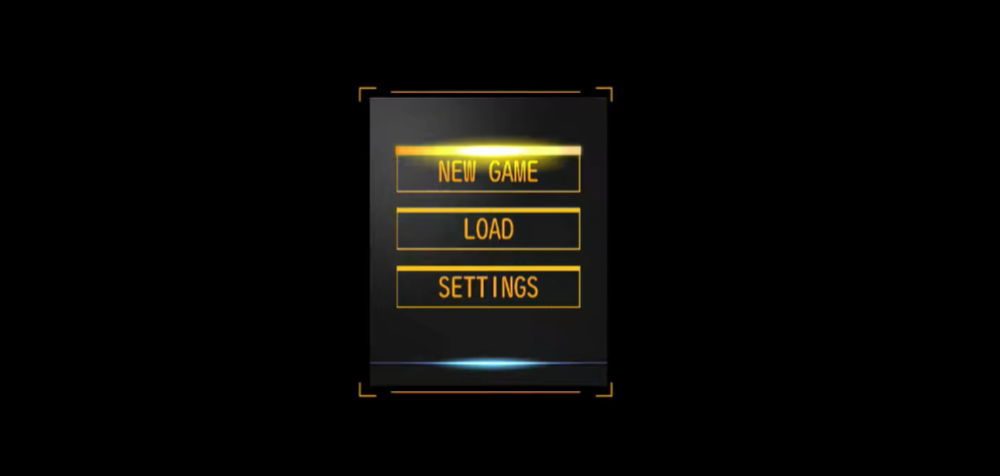
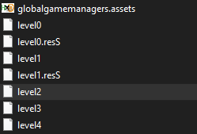
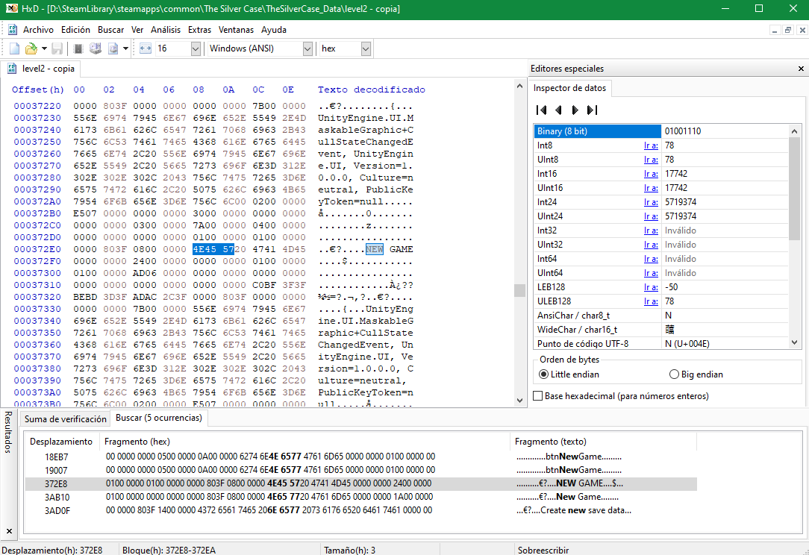
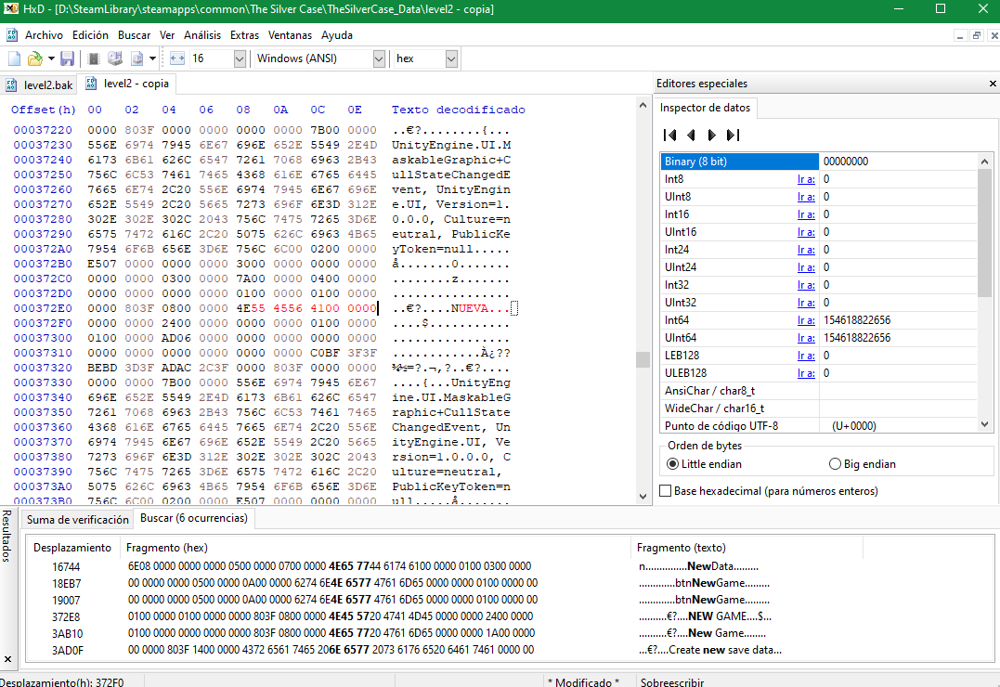
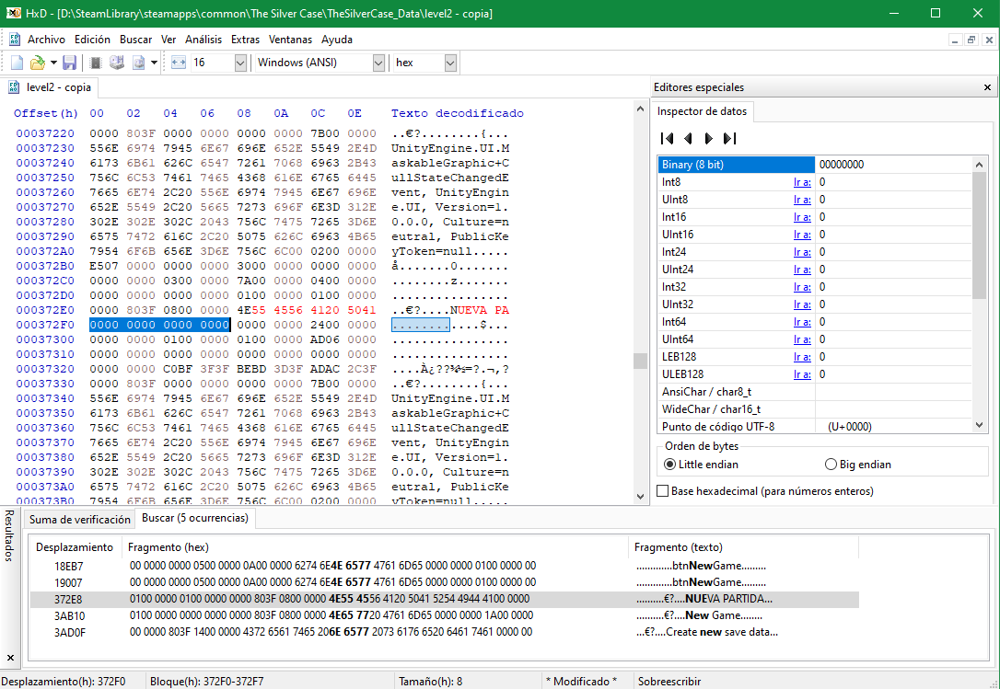
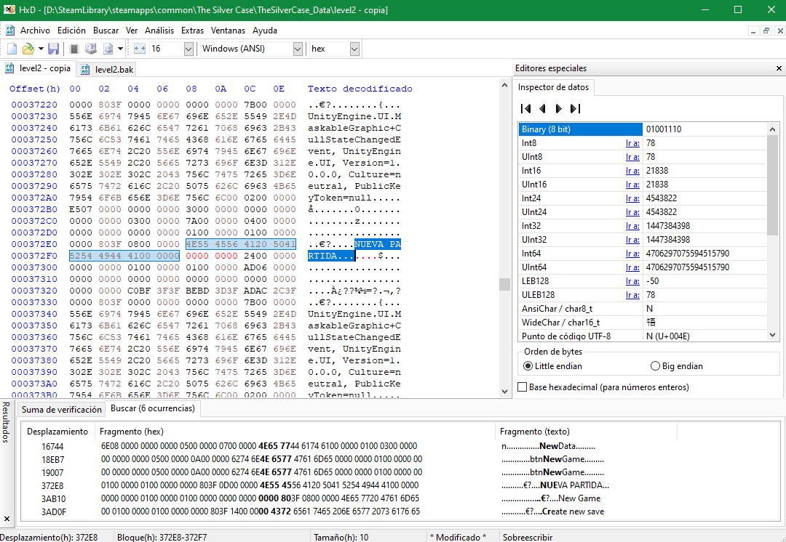
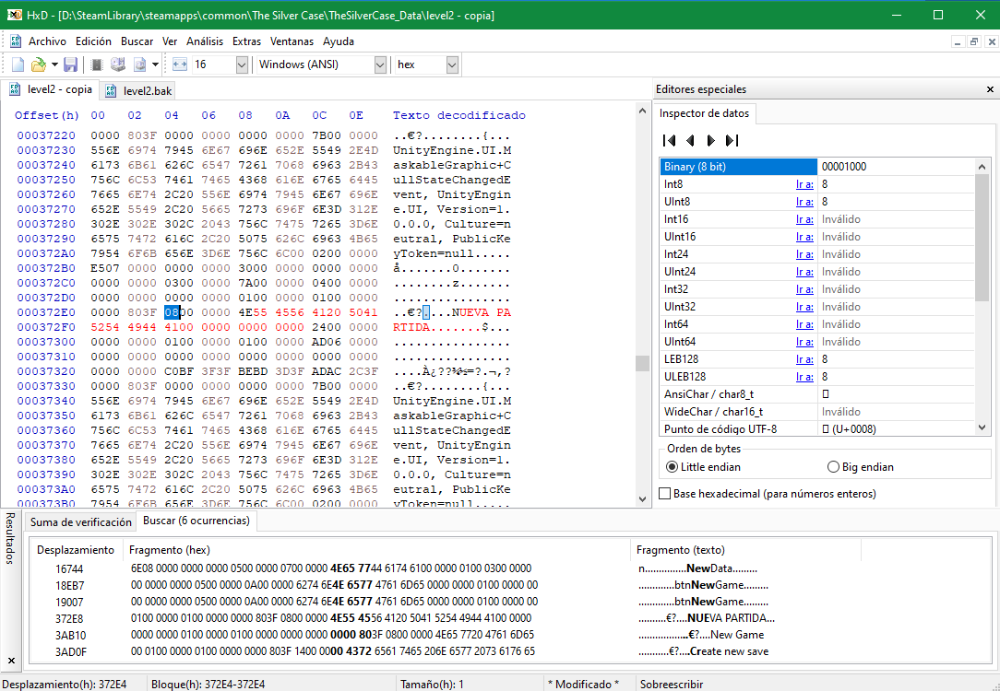
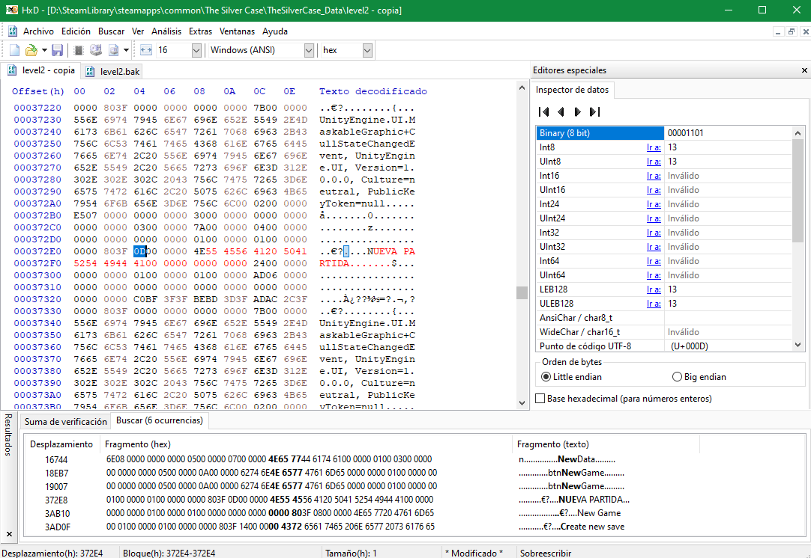
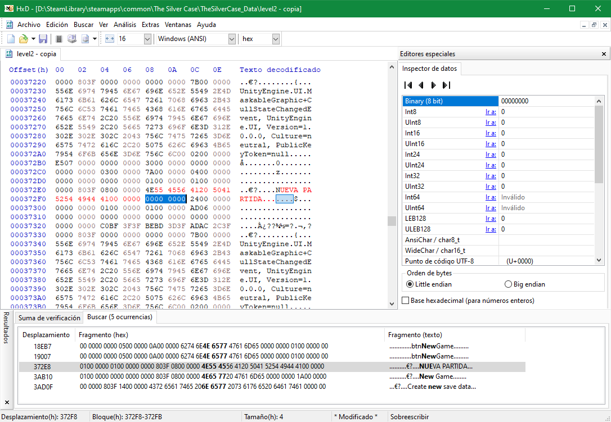

# Menu Texts

This section covers the translation of UI texts that appear in menus, settings screens, loading screens, and other graphical user interface elements throughout the game.

## Files to Edit

The menu texts and GUI elements are distributed across several asset files that need to be edited using a hex editor:

- **resources.assets** - Contains the main menu texts and UI elements used across the game
- **sharedassets6.assets** - Additional shared UI and menu text assets
- **level1, level2, level3, level4, level5, level6** - Each chapter level file contains level-specific menu and UI texts
- **Assembly-CSharp.dll** - Some texts are around the Assembly CSharp file. Must edit with dnSpy

## Editing Process

You'll have to open these files with a hex editor and search for the specific menu texts you need to translate. There are many texts scattered throughout these files, and the easiest approach is to search for recognizable English text strings directly within the binary data.

Additionally, some menu and GUI texts are also stored in the Assembly-CSharp.dll file and can be located and edited using dnSpy.

### Example: Changing "New Game" Text

Let's walk through a practical example. We'll change the "New Game" text from the main game menu to its Spanish version: "Nueva Partida". This example will also demonstrate how to handle cases where the replacement text is longer than the original.

**Step 1: Locate the File**

The "New Game" text is stored in the **level2** file. Open this file with HexEditor.

**Step 2: Search for the Text**

Use the search function (**Search > Find** or **Ctrl + F**) to locate the text. We'll search for "NEW" (part of "New Game") to find the exact location. The text is located at offset **000372E0**.

**Step 3: Replace the Text**

Once you've found the text, press the **Ins** key to enable Insert mode, which allows you to type new characters. Now you can replace the text on the right side of the editor where the ASCII representation is shown.

If your replacement text is shorter than the original, fill the remaining space with binary zeros (**00**) on the left side of the editor (the hexadecimal view) to preserve the file structure.

**Step 4: Handle Text Length Differences**

In our case, "Nueva Partida" is longer than "New Game". Binary texts in these files must fit within 8-bit slots (represented as **0000 0000** sequences, this is equal to 4 bytes). Since our new text is longer, we need to add extra space by replacing 8 zeros with the additional characters needed.

The text "NUEVA PARTIDA" requires 16 additional bits (8 bytes) more than the original "NEW GAME":

**Step 5: Change the text length value**

An important step is to modify the **text length value**. Notice that "NEW GAME" has 8 characters, and 4 bytes to the left of the text start, you'll find the value **08** (in hexadecimal), which defines the text length. This value must be changed to match the number of characters in your new text. 

In our case, "NUEVA PARTIDA" has 13 characters, and 13 in hexadecimal is **0D**, so we need to replace **08** with **0D**. 

This same principle applies to almost all text replacements in binary files - always update the length value that precedes the actual text.

**Step 6: Save and Reimport**

Once you've finished editing, save the file and reimport it back into the game using the appropriate asset import tool (UABEA or UnityEX) to see your changes in action.

### Important Note on Binary File Structure

When editing Unity binary files, it's crucial to maintain the correct spacing between values. Each text entry consists of three distinct components:

1. **Text Length Value** - The byte(s) that define how many characters the text contains
2. **The Text Itself** - The actual string data
3. **Padding Bytes** - Always 4 bytes of **00** values until the next entry begins

You must always preserve these 4-byte gaps between values. If the spacing is incorrect or the file structure is corrupted, the game will crash when it tries to read the file. If you experience unexpected crashes after launching the game, check that you've maintained proper spacing and updated the length values correctly.

